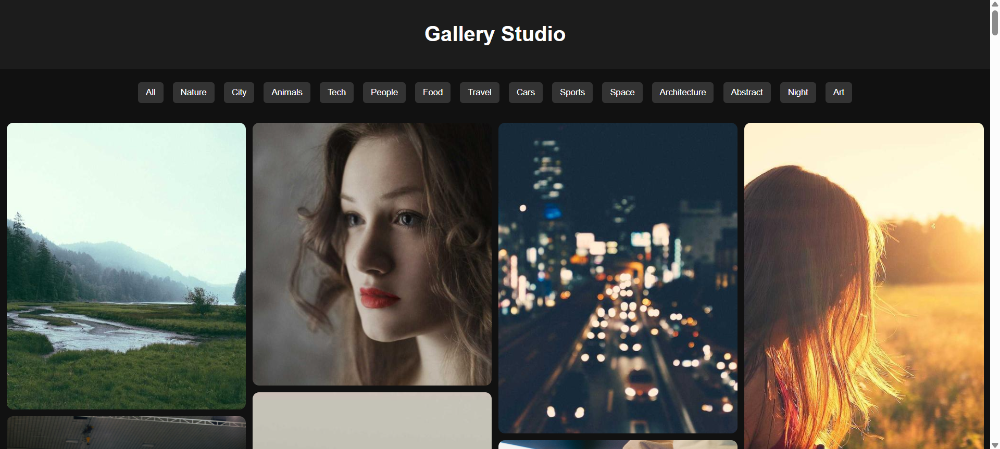

# 🖼️ Modern Gallery Studio

A responsive and interactive image gallery web application built using **HTML, CSS, and JavaScript**. It features category filtering, masonry-style layout, and a lightbox viewer with navigation controls.

---

## 🚀 Live Demo
**Once hosted via GitHub Pages**: https://kaveeshamalindi.github.io/Gallary-Studio/
<br> <br>

<p align="center">
  
</p>

---

## ✨ Features

- 📂 Category-based filtering (Nature, City, Animals, Tech, etc.)
- 🧱 Masonry-style responsive grid layout
- 🔍 Lightbox image viewer
- ⬅️➡️ Next / Previous navigation inside lightbox
- 📱 Fully responsive design (mobile-friendly)
- ⚡ Smooth hover and transition effects
- 🖱️ Click-to-view image expansion

---

## 🛠️ Built With

- HTML5
- CSS3
- JavaScript

---

## 📁 Project Structure

```
gallery-studio/
│
├── index.html # Main webpage
├── styles.css # Styling file
├── script.js  # Functionality (filter + lightbox)
├── Images     # UI
└── README.md  # Project documentation
```

---

## 📸 How It Works

1. Click filter buttons to display specific image categories.
2. Click any image to open the lightbox.
3. Use arrows to navigate between images.
4. Close the lightbox using the × button.

---

## 📦 Setup Instructions

**To run locally:**

1. Download or clone the repository

```
git clone https://github.com/Kaveeshamalindi/Gallary-Studio.git
```

2. Open ```index.html``` in your browser

**👉 No installation or dependencies required.**

---

## 🎯 Future Improvements

- Image search functionality
- Lazy loading for performance
- Drag/swipe support for mobile
- Dark/light theme toggle
- Backend image upload system

---

 Don't forget to hit the ⭐ if you like this repo. 


